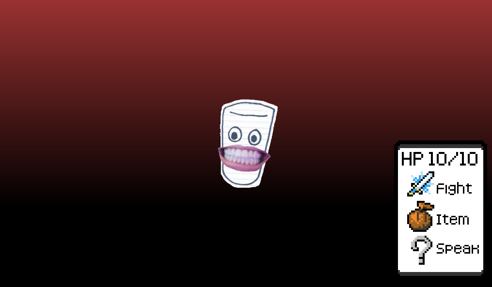

# How was I supposed to know my roommate was a dimension hopping witch!?
 

This is a game about being roommates and my submission for [Summer Fediverse Jam](https://itch.io/jam/summer-fediverse-jam).

The jam's theme is "Parallel Worlds".

---------------

  

---------------

This game was made with Godot which is [licensed under the MIT license](https://godotengine.org/license/).

---------------

### External assets used

**Title:** [Office Space Tileset](https://opengameart.org/content/office-space-tileset)

**Author:** [no2games](https://opengameart.org/users/no2games)

**URL:** [https://opengameart.org/content/office-space-tileset](https://opengameart.org/content/office-space-tileset)

**License(s):** CC0 ( [https://creativecommons.org/publicdomain/zero/1.0/](https://creativecommons.org/publicdomain/zero/1.0/) )

---

**Title:** [Tiny Characters Set](https://opengameart.org/content/tiny-characters-set)

**Author:** [Fleurman](https://opengameart.org/users/fleurman)

**URL:** [https://opengameart.org/content/tiny-characters-set](https://opengameart.org/content/tiny-characters-set)

**License(s):** CC0 ( [https://creativecommons.org/publicdomain/zero/1.0/](https://creativecommons.org/publicdomain/zero/1.0/) )

---

**Title:** [The Field of the Floating Islands](https://opengameart.org/content/the-field-of-the-floating-islands)

**Author:** [Buch](https://opengameart.org/users/buch)

**Collaborators:** [devurandom](https://opengameart.org/users/devurandom), [surt](https://opengameart.org/users/surt)

**URL:** [https://opengameart.org/content/the-field-of-the-floating-islands](https://opengameart.org/content/the-field-of-the-floating-islands)

**License(s):** CC0 ( [https://creativecommons.org/publicdomain/zero/1.0/](https://creativecommons.org/publicdomain/zero/1.0/) )

---

**Title:** [Inventory filter icons](https://opengameart.org/content/inventory-filter-icons)

**Author:** [twiswist](https://opengameart.org/users/twiswist)

**URL:** [https://opengameart.org/content/inventory-filter-icons](https://opengameart.org/content/inventory-filter-icons)

**License(s):** CC0 ( [https://creativecommons.org/publicdomain/zero/1.0/](https://creativecommons.org/publicdomain/zero/1.0/) )

---

**Title:** [Space Music](https://opengameart.org/content/space-music)

**Author:** [mrpoly](https://opengameart.org/users/mrpoly)

**URL:** [https://opengameart.org/content/space-music](https://opengameart.org/content/space-music)

**License(s):** CC0 ( [https://creativecommons.org/publicdomain/zero/1.0/](https://creativecommons.org/publicdomain/zero/1.0/) )

---

**Title:** [Briefing](https://opengameart.org/content/briefing)

**Author:** [congusbongus](https://opengameart.org/users/congusbongus)

**URL:** [https://opengameart.org/content/briefing](https://opengameart.org/content/briefing)

**License(s):** CC0 ( [https://creativecommons.org/publicdomain/zero/1.0/](https://creativecommons.org/publicdomain/zero/1.0/) )

---

**Title:**  [Blue Rain](https://opengameart.org/content/blue-rain)

**Author:** [Alex McCulloch](https://opengameart.org/users/pro-sensory)

**URL:** [https://opengameart.org/content/blue-rain](https://opengameart.org/content/blue-rain)

**License(s):** CC0 ( [https://creativecommons.org/publicdomain/zero/1.0/](https://creativecommons.org/publicdomain/zero/1.0/) )

---

**Title:**  [6 Short water splashes](https://opengameart.org/content/6-short-water-splashes)

**Author:** [ezwa](http://www.pdsounds.org/users/ezwa)

**URL:** [https://opengameart.org/content/6-short-water-splashes](https://opengameart.org/content/6-short-water-splashes)

**License(s):** CC0 ( [https://creativecommons.org/publicdomain/zero/1.0/](https://creativecommons.org/publicdomain/zero/1.0/) )

---

**Title:**  [NES Sounds](https://opengameart.org/content/nes-sounds)

**Author:** [Baŝto](https://opengameart.org/users/ba%C5%9Dto)

**URL:** [https://opengameart.org/content/nes-sounds](https://opengameart.org/content/nes-sounds)

**License(s):** CC0 ( [https://creativecommons.org/publicdomain/zero/1.0/](https://creativecommons.org/publicdomain/zero/1.0/) )

---

**Title:** [Animated emote bubbles](https://opengameart.org/content/animated-emote-bubbles)

**Author:** [Game Dev Alliance](https://opengameart.org/users/game-dev-alliance)

**URL:** [https://opengameart.org/content/animated-emote-bubbles](https://opengameart.org/content/animated-emote-bubbles)

**License(s):** CC0 ( [https://creativecommons.org/publicdomain/zero/1.0/](https://creativecommons.org/publicdomain/zero/1.0/) )

---

**Title:** [16x16 Pixel Island Assets](https://opengameart.org/content/16x16-pixel-island-assets)

**Author:** [heartsynth](https://opengameart.org/users/heartsynth)

**URL:** [https://opengameart.org/content/16x16-pixel-island-assets](https://opengameart.org/content/16x16-pixel-island-assets)

**License(s):** CC0 ( [https://creativecommons.org/publicdomain/zero/1.0/](https://creativecommons.org/publicdomain/zero/1.0/) )

---

**Title:** [Skipping into the abyss (loop)](https://opengameart.org/content/skipping-into-the-abyss-loop)

**Author:** [Alex McCulloch](https://opengameart.org/users/heartsynth)

**URL:** [https://opengameart.org/content/skipping-into-the-abyss-loop](https://opengameart.org/content/skipping-into-the-abyss-loop)

**License(s):** CC0 ( [https://creativecommons.org/publicdomain/zero/1.0/](https://creativecommons.org/publicdomain/zero/1.0/) )

---

**Title:** [Modern Ringtone [Chirptone]](https://opengameart.org/content/modern-ringtone-chirptone)

**Author:** [Zane Little](https://opengameart.org/users/zane-little-music)

**URL:** [https://opengameart.org/content/modern-ringtone-chirptone](https://opengameart.org/content/modern-ringtone-chirptone)

**License(s):** CC0 ( [https://creativecommons.org/publicdomain/zero/1.0/](https://creativecommons.org/publicdomain/zero/1.0/) )

---

**Title:** [Kenney fonts](https://opengameart.org/content/kenney-fonts)

**Author:** [Kenney](https://opengameart.org/users/kenney)

**URL:** [https://opengameart.org/content/kenney-fonts](https://opengameart.org/content/kenney-fonts)

**License(s):** CC0 ( [https://creativecommons.org/publicdomain/zero/1.0/](https://creativecommons.org/publicdomain/zero/1.0/) )
